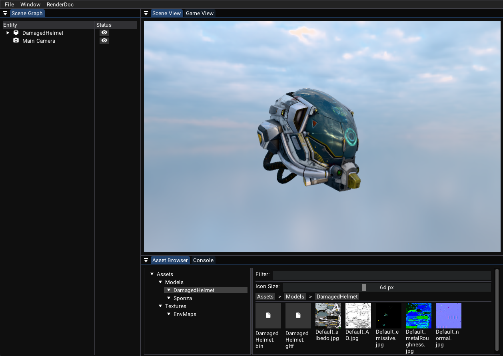

# Vultra

<h4 align="center">
  Vultra is a modern 3D engine for game development, graphics research and more.
</h4>

<p align="center">
    <a href="https://github.com/zzxzzk115/Vultra/actions" alt="Build-Windows">
        </a>
    <a href="https://github.com/zzxzzk115/Vultra/actions" alt="Build-Linux">
        </a>
    <a href="https://github.com/zzxzzk115/Vultra/actions" alt="Build-macOS">
        </a>
    <a href="https://github.com/zzxzzk115/Vultra/issues" alt="GitHub Issues">
        
    </a>
    <a href="https://www.codefactor.io/repository/github/zzxzzk115/vultra"></a>
    <a href="https://github.com/zzxzzk115/Vultra/blob/master/LICENSE" alt="GitHub">
        
    </a>
</p>

(This project is under early development and WIP.)

Vultra is based on [libvultra](https://github.com/zzxzzk115/libvultra).



## Features
- User-friendly Editor

## Build Instructions

Prerequisites:
- Git
- XMake
- Vulkan SDK
- Visual Studio with MSVC if Windows
- GCC or Clang if Linux/Unix
- XCode with GCC or Apple Clang if macOS

Step-by-Step:

- Install XMake by following [this](https://xmake.io/guide/quick-start.html#installation). 

- Clone the project:
  ```bash
  git clone --recursive https://github.com/zzxzzk115/Vultra.git
  ```

- Build the project:
  ```bash
  cd Vultra
  git submodule update --init --recursive
  xmake -vD
  ```

- Run the Editor
  ```bash
  xmake run VultraEditor
  ```

  > **Tips:**
  > For OpenXR programs, you may need to set the XR_RUNTIME_JSON environment variable.
  > For debugging OpenXR programs without headsets, you may need Meta XR Simulator on Windows and macOS. On Linux, you can use Monado as the simulator.

## TODO List
- [ ] Editor Windows
  - [ ] Asset Browser
    - [x] Tree View
    - [x] Filter
    - [x] Grid View & List View
    - [ ] Right-click menus
      - [ ] Reimport
      - [ ] Create
      - [ ] Delete
      - [ ] Rename
  - [ ] Scene Graph
    - [x] Tree View
    - [x] Status View
    - [ ] Right-click menus
      - [x] Create New Entity
      - [x] Delete Entity
      - [x] Rename Entity
      - [ ] Create Others
  - [ ] Scene View
    - [x] Render Target View
    - [ ] Tool bar
    - [ ] 3D Gizmos
    - [ ] Entity Selection
  - [ ] Game View
  - [ ] Inspector
- [ ] Project Management
- [ ] Hot-Reload

## License
This project is under the [MIT](LICENSE) license.